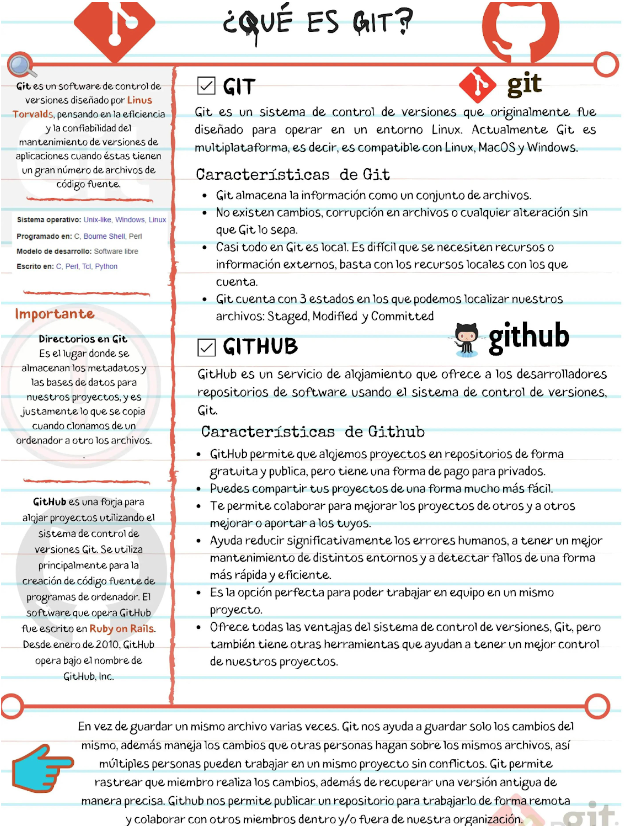

# GIT & GITHUB

[Version en notion](https://www.notion.so/GIT-GITHUB-640e6178ba564651a3c62c3dfb9e107e) 

- GENERALIDADES
    
    Un sistema de control de versiones como Git nos ayuda a guardar el historial de cambios y crecimiento de los archivos de nuestro proyecto.
    
    En realidad, los cambios y diferencias entre las versiones de nuestros proyectos pueden tener similitudes, algunas veces los cambios pueden ser solo una palabra o una parte específica de un archivo específico. Git está optimizado para guardar todos estos cambios de forma atómica e incremental, o sea, aplicando cambios sobre los últimos cambios, estos sobre los cambios anteriores y así hasta el inicio de nuestro proyecto.
    
    - El comando para iniciar nuestro repositorio, o sea, indicarle a Git que queremos usar su sistema de control de versiones en nuestro proyecto, es git init.
    - El comando para que nuestro repositorio sepa de la existencia de un archivo o sus últimos cambios es git add. Este comando no almacena las actualizaciones de forma definitiva, únicamente las guarda en algo que conocemos como “Staging Area” (área de montaje o ensayo).
    - El comando para almacenar definitivamente todos los cambios que por ahora viven en el staging area es git commit. También podemos guardar un mensaje para recordar muy bien qué cambios hicimos en este commit con el argumento -m "Mensaje del commit".
    - Por último, si queremos mandar nuestros commits a un servidor remoto, un lugar donde todos podamos conectar nuestros proyectos, usamos el comando git push.
    
    Comandos básicos de git:
    
    - git init: inicializa un repositorio de GIT en la carpeta donde se ejecute el comando.
    - git add: añade los archivos especificados al área de preparación (staging).
    - git commit -m “commit description”: confirma los archivos que se encuentran en el área de preparación y los agrega al repositorio.
    - git add . : otra opción para agregar archivos. Cuando le agregas el punto lo que hace es que agregas todos los archivos que hayan cambiado en la carpeta que en ese momento estás.
    - git commit -am “commit description”: añade al staging area y hace un commit mediante un solo comando. (No funciona con archivos nuevos, es decir, que les había hecho add previamente)
    - git status: ofrece una descripción del estado de los archivos (untracked, ready to commit, nothing to commit).
    - git rm (. -r, filename) (–cached): remueve los archivos del index.
    - git config --global user.email tu@email.com: configura un email.
    - git config --global user.name <Nombre como se verá en los commits>: configura un nombre.
    - git config --list: lista las configuraciones.
    
    Analizar cambios en los archivos de un proyecto Git:
    
    - git log: lista de manera descendente los commits realizados.
    - git log --stat: además de listar los commits, muestra la cantidad de bytes añadidos y eliminados en cada uno de los archivos modificados.
    - git log --all --graph --decorate --oneline: muestra de manera comprimida toda la historia del repositorio de manera gráfica y embellecida.
    - git show filename: permite ver la historia de los cambios en un archivo.
    - git diff <commitMASRECIENTE> <commitDECOMPARACION>: compara diferencias entre en cambios confirmados. Recordemos que hay un espacio entre commit1 y commit2, y estos son los numeros y letras largos.
    
    Volver en el tiempo con branches y checkout:
    
    - git reset <commit> --soft/hard: regresa al commit especificado, eliminando todos los cambios que se hicieron después de ese commit.
    - git checkout <commit/branch> <filename>: permite regresar al estado en el cual se realizó un commit o branch especificado, pero no elimina lo que está en el staging area.
    - git checkout – <filePath>: deshacer cambios en un archivo en estado modified (que ni fue agregado a staging)
    
    git rm: Este comando nos ayuda a eliminar archivos de Git sin eliminar su historial del sistema de versiones. Esto quiere decir que si necesitamos recuperar el archivo solo debemos “viajar en el tiempo” y recuperar el último commit antes de borrar el archivo en cuestión.
    
    git rm no puede usarse por sí solo, así nomás. Se debe utilizar uno de los flags para indicar a Git cómo eliminar los archivos que ya no se necesitan en la última versión del proyecto:
    
    - git rm --cached <archivo/s>: elimina los archivos del área de Staging y del próximo commit, pero los mantiene en nuestro disco duro.
    - git rm --force <archivo/s>: elimina los archivos de Git y del disco duro. Git siempre guarda todo, por lo que podemos acceder al registro de la existencia de los archivos, de modo que podremos recuperarlos si es necesario (pero debemos aplicar comandos más avanzados).
    
    Git reset: Con git reset volvemos al pasado sin la posibilidad de volver al futuro. Borramos la historia y la debemos sobreescribir.
    
    git reset --soft: Vuelve el branch al estado del commit especificado, manteniendo los archivos en el directorio de trabajo y lo que haya en staging considerando todo como nuevos cambios. Así podemos aplicar las últimas actualizaciones a un nuevo commit.
    
    git reset --hard: Borra absolutamente todo. Toda la información de los commits y del área de staging se borra del historial.
    
    git reset HEAD: No borra los archivos ni sus modificaciones, solo los saca del área de staging, de forma que los últimos cambios de estos archivos no se envíen al último commit. Si se cambia de opinión se los puede incluir nuevamente con git add.
    
    Ramas o Branches en git: Al crear una nueva rama se copia el último commit en esta nueva rama. Todos los cambios hechos en esta rama no se reflejarán en la rama master hasta que hagamos un merge.
    
    - git branch <new branch>: crea una nueva rama.
    - git checkout <branch name>: se mueve a la rama especificada.
    - git merge <branch name>: fusiona la rama actual con la rama especificada y produce un nuevo commit de esta fusión.
    - git branch: lista las ramas generadas.
    
    Git es un sistema de control de versiones distribuido, diseñado por Linus Torvalds. Está pensando en la eficiencia y la confiabilidad del mantenimiento de versiones de aplicaciones cuando estas tienen un gran número de archivos de código fuente.
    
    - Git está optimizado para guardar cambios de forma incremental.
    - Permite contar con un historial, regresar a una versión anterior y agregar funcionalidades.
    - Lleva un registro de los cambios que otras personas realicen en los archivos.
    
    Git fue diseñado para operar en un entorno Linux. Actualmente, es multiplataforma, es decir, es compatible con Linux, MacOS y Windows. En la máquina local se encuentra Git, se utiliza bajo la terminal o línea de comandos y tiene comandos como merge, pull, add, commit y rebase, entre otros.
    
    Para qué proyectos sirve Git: Con Git se obtiene una mayor eficiencia usando archivos de texto plano, ya que con archivos binarios no puede guardar solo los cambios, sino que debe volver a grabar el archivo completo ante cada modificación, por mínima que sea, lo que hace que incremente demasiado el tamaño del repositorio.
    
    “Guardar archivos binarios en el repositorio de Git no es una buena práctica, únicamente deberían guardarse archivos pequeños (como logos) que no sufran casi modificaciones durante la vida del proyecto. Los binarios deben guardarse en un CDN”.
    
    Características de Git:
    
    - Git almacena la información como un conjunto de archivos.
    - No existen cambios, corrupción en archivos o cualquier alteración sin que Git lo sepa.
    - Casi todo en Git es local. Es difícil que se necesiten recursos o información externos, basta con los recursos locales con los que cuenta.
    - Git cuenta con 3 estados en los que es posible localizar archivos: Staged, Modified y Committed.
    
    ¿Qué es un sistema de control de versiones?: El SCV o VCS (por sus siglas en inglés) es un sistema que registra los cambios realizados sobre un archivo o conjunto de archivos a lo largo del tiempo, de modo que puedas llevar el historial del ciclo de vida de un proyecto, comparar cambios a lo largo del tiempo, ver quién los realizó o revertir el proyecto entero a un estado anterior.
    
    Cualquier tipo de archivo que se encuentre en un ordenador puede ponerse bajo control de versiones.
    
    ¿Qué es Github?: Github es una plataforma de desarrollo colaborativo para alojar proyectos utilizando el sistema de control de versiones Git. Se emplea principalmente para la creación de código fuente de programas de computadora.
    
    Puede considerarse a Github como la red social de código para los programadores y en muchos casos es visto como un curriculum vitae, pues aquí se guarda el portafolio de proyectos de programación.
    
    Características de Github:
    
    - GitHub permite alojar proyectos en repositorios de forma gratuita y pública, pero tiene una forma de pago para privados.
    - Puedes compartir fácilmente tus proyectos.
    - Permite colaborar para mejorar los proyectos de otros y a otros mejorar o aportar a los tuyos.
    - Ayuda a reducir significativamente los errores humanos, a tener un mejor mantenimiento de distintos entornos y a detectar fallos de una forma más rápida y eficiente.
    - Es la opción perfecta para poder trabajar en equipo en un mismo proyecto.
    - Ofrece todas las ventajas del sistema de control de versiones Git, pero también tiene otras herramientas que ayudan a tener un mejor control de los proyectos.
    
    
    
- EDITORES DE CÓDIGO, ARCHIVOS BINARIOS Y DE TEXTO PLANO
    
    Un editor de código o IDE es una herramienta que nos brinda muchas ayudas para escribir código, algo así como un bloc de notas muy avanzado. Los editores más populares son VSCode, Sublime Text y Atom, pero no es obligatorio usar alguno de estos para programar.
    
    Tipos de archivos y sus diferencias:
    
    - Archivos de Texto (.txt): Texto plano normal y sin nada especial. Lo vemos igual sin importar dónde lo abramos, ya sea con el bloc de notas o con editores de texto avanzados.
    - Archivos RTF (.rtf): Podemos guardar texto con diferentes tamaños, estilos y colores; pero no podemos poner imágenes. Pero si lo abrimos desde un editor de código, vamos a ver que es mucho más complejo que solo el texto plano. Esto es porque debe guardar todos los estilos del texto y, para esto, usa un código especial un poco difícil de entender y muy diferente a los textos con estilos especiales al que estamos acostumbrados.
    - Archivos de Word (.docx): Podemos guardar imágenes y texto con diferentes tamaños, estilos o colores. Al abrirlo desde un editor de código podemos ver que es código binario, muy difícil de entender y muy diferente al texto al que estamos acostumbrados. Esto es porque Word está optimizado para entender este código especial y representarlo gráficamente.
    
    Recuerda que debes habilitar la opción de ver la extensión de los archivos, de lo contrario, solo podrás ver su nombre. La forma de hacerlo en Windows es Vista > Mostrar u ocultar > Extensiones de nombre de archivo.
    
    Conceptos importantes de Git
    
    - Bug: Error en el código
    - Repository: Donde se almacena todo el proyecto, el cual puede vivir tanto en local como en remoto. El repositorio guarda un historial de versiones y, más importante, de la relación de cada versión con la anterior para que pueda hacerse el árbol de versiones con las diferentes ramas.
    - Fork: Si en algún momento queremos contribuir al proyecto de otra persona, o si queremos utilizar el proyecto de otro como el punto de partida del nuestro. Esto se conoce como “fork”.
    - Clone: Una vez se decide hacer un fork , hasta ese momento sólo existe en GitHub. Para poder trabajar en el proyecto, toca clonar el repositorio elegido al computador personal.
    - Branch: Es una bifurcación del proyecto que se está realizando para anexar una nueva funcionalidad o corregir un bug.
    - Master: Rama donde se almacena la última versión estable del proyecto que se está realizando. La rama master es la que está en producción en cada momento (o casi) y debería estar libre de bugs. Así, si esta rama está en producción, sirve como referente para hacer nuevas funcionalidades y/o arreglar bugs de última hora.
    - Commit: consiste en subir cosas a la versión local del repositorio. De esta manera se puede trabajar en la rama de forma local sin tener que modificar ninguna versión en remoto ni tener que tener la última versión remota, cosa muy útil en grandes desarrollos trabajados por varias personas.
    - Push: Consiste en enviar todo lo que se ha confirmado con un commit al repositorio remoto. Aquí es donde se une nuestro trabajo con el de los demás.
    - Checkout: Acción de descargarse una rama del repositorio GIT local (sí, GIT tiene su propio repositorio en local para poder ir haciendo commits) o remoto.
    - Fetch: Actualiza el repositorio local bajando datos del repositorio remoto al repositorio local sin actualizarlo, es decir, se guarda una copia del repositorio remoto en el local.
    - Merge: La acción de merge es la continuación natural del fetch. El merge permite unir la copia del repositorio remoto con tu repositorio local, mezclando los diferentes códigos.
    - Pull: Consiste en la unión del fetch y del merge, esto es, recoge la información del repositorio remoto y luego mezcla el trabajo en local con esta.
    - Diff: Se utiliza para mostrar los cambios entre dos versiones del mismo archivo.
- INTRODUCCIÓN A LA TERMINAL Y LÍNEA DE COMANDOS
    
    La línea de comandos nos permite interactuar con nuestro computador sin necesidad de utilizar una interfaz gráfica. Sin embargo, los computadores emplean distintos sistemas de archivos y manejan diferentes comandos, dependiendo del sistema operativo que utilicen.
    
    Diferencias entre la estructura de archivos de Windows, Mac o Linux:
    
    - La ruta principal en Windows es C:\, en UNIX es solo /.
    - Windows no hace diferencia entre mayúsculas y minúsculas pero UNIX sí.
    
    Recuerda que GitBash usa la ruta /c para dirigirse a C:\ (o /d para dirigirse a D:\) en Windows. Por lo tanto, la ruta del usuario con el que estás trabajando es /c/Users/Nombre de tu usuario
    
    Comandos básicos en la terminal:
    
    - pwd: Nos muestra la ruta de carpetas en la que te encuentras ahora mismo.
    - mkdir: Nos permite crear carpetas (por ejemplo, mkdir Carpeta-Importante).
    - touch: Nos permite crear archivos (por ejemplo, touch archivo.txt).
    - rm: Nos permite borrar un archivo o carpeta (por ejemplo, rm archivo.txt). Mucho cuidado con este comando, puedes borrar todo tu disco duro.
    - cat: Ver el contenido de un archivo (por ejemplo, cat nombre-archivo.txt).
    - ls: Nos permite cambiar ver los archivos de la carpeta donde estamos ahora mismo. Podemos usar uno o más argumentos para ver más información sobre estos archivos (los argumentos pueden ser -- + el nombre del argumento o - + una sola letra o shortcut por cada argumento).
        - ls -a: Mostrar todos los archivos, incluso los ocultos.
        - ls -l: Ver todos los archivos como una lista.
    - cd: Nos permite navegar entre carpetas.
        - cd /: Ir a la ruta principal:
        - cd o cd ~: Ir a la ruta de tu usuario
        - cd carpeta/subcarpeta: Navegar a una ruta dentro de la carpeta donde estamos ahora mismo.
        - cd .. (cd + dos puntos): Regresar una carpeta hacia atrás.
        - Si quieres referirte al directorio en el que te encuentras ahora mismo puedes usar cd . (cd + un punto).
    - History: Ver los últimos comandos que ejecutamos y un número especial con el que podemos repetir su ejecución.
    - ! + número: Ejecutar algún comando con el número que nos muestra el comando history (por ejemplo, !72).
    - clear: Para limpiar la terminal. También podemos usar los atajos de teclado Ctrl + L o Command + L.
    - comando + --help: muestra una serie de explicaciones de cómo funciona cada uno de los comandos.
    
    Todos estos comandos tienen una función de autocompletado, o sea, puedes escribir la primera parte y presionar la tecla Tab para que la terminal nos muestre todas las posibles carpetas o comandos que podemos ejecutar. Si presionas la tecla Arriba puedes ver el último comando que ejecutamos.
    
    Recuerda que podemos descubrir todos los argumentos de un comando con el argumento --help (por ejemplo, cat --help).
    
- CREA UN REPOSITORIO DE GIT Y HAZ TU PRIMER COMMIT
    
    Le indicaremos a Git que queremos crear un nuevo repositorio para utilizar su sistema de control de versiones. Solo debemos posicionarnos en la carpeta raíz de nuestro proyecto y ejecutar el comando: git init.
    
    Recuerda que al ejecutar este comando (y de aquí en adelante) vamos a tener una nueva carpeta oculta llamada .git con toda la base de datos con cambios atómicos en nuestro proyecto.
    
    Recuerda que Git está optimizado para trabajar en equipo, por lo tanto, debemos darle un poco de información sobre nosotros. No debemos hacerlo todas las veces que ejecutamos un comando, basta con ejecutar solo una sola vez los siguientes comandos con tu información:
    
    
    
    Existen muchas otras configuraciones de Git que puedes encontrar ejecutando el comando git config --list (o solo git config para ver una explicación más detallada).
    
    Si quieres ver los archivos ocultos de una carpeta puedes habilitar la opción de Vista > Mostrar u ocultar > Elementos ocultos (en Windows) o ejecutar el comando ls -a.
    
    Comandos para iniciar tu repositorio con Git
    
    - git init: para inicializar el repositorio git y el staged
    - git add nombre_del_archivo.txt: enviar el archivo al staged
    - git status: ver el estado, si se requiere agregar al starget o si se requiere commit
    - git conf: para ver las posibles configuraciones
    - git conf --list: para ver la lista de configuraciones hechas
    - git conf --list --show-origin: para mostrar las configuraciones y sus rutas
    - git rm --cached nombre_del_archivo.txt: para eliminar el archivo del staged(ram)
    - git rm nombre_del_archivo.txt: para eliminar del repositorio
    
    Si por algún motivo te equivocaste en el nombre o email que configuraste al principio, lo puedes modificar de la siguiente manera:
    
    git config --global --replace-all user.name “Aquí va tu nombre modificado”
    
    O si lo deseas eliminar y añadir uno nuevo
    
    git config --global --unset-all user.name :Elimina el nombre del usuario
    
    git config --global --add user.name “Aquí va tu nombre”
    
- ANALIZAR CAMBIOS EN LOS ARCHIVOS DE TU PROYECTO CON GIT
    
    El comando git show nos muestra los cambios que han existido sobre un archivo y donde está el HEAD; y es muy útil para detectar cuándo se produjeron ciertos cambios, qué se rompió y cómo lo podemos solucionar. Pero podemos ser más detallados.
    
    Si queremos ver la diferencia entre una versión y otra, no necesariamente todos los cambios desde la creación del archivo, podemos usar el comando git diff commitA commitB.
    
    Recuerda que puedes obtener el ID de tus commits con el comando git log.
    
    Comandos para analizar cambios en GIT
    
    - git init: inicializar el repositorio
    - git add nombre_de_archivo.extensión: agregar el archivo al repositorio
    - git commit -m “Mensaje”: Agregamos los cambios para el repositorio
    - git add: Agregar los cambios de la carpeta en la que nos encontramos agregar todo
    - git status: visualizar cambios
    - git log nombre_de_archivos.extensión: histórico de cambios con detalles
    - git push: envía a otro repositorio remoto lo que estamos haciendo
    - git pull: traer repositorio remoto
    - ls: listado de carpetas en donde me encuentro. Es decir, como emplear dir en windows.
    - pwd: ubicación actual
    - mkdir: make directory nueva carpeta
    - touch archivo.extensión: crear archivo vacío
    - cat archivo.extensión: muestra el contenido del archivo
    - history: historial de comandos utilizados durante esa sesión
    - rm archivo.extensión: Eliminación de archivo
    - comando --help: ayuda sobre el comando
    - git checkout: traer cambios realizados
    - git rm --cached archivo.extensión: se utiliza para devolver el archivo que se tiene en ram. Cuando escribimos git add, lo devuelve a estado natural mientras está en staging.
    - git config --list: muestra la lista de configuración de git
    - git config --list --show-origin: rutas de acceso a la configuración de git
    - git log archivo.extensión: muestra la historia del archivo
    
    Al hacer git show nos salen varias cosas:
    
    
    
    Esto significa que estoy en la versión más reciente del archivo.
    
    
    
    un diff es agarrar la versión anterior con la versión nueva y mostrarme la diferencia
    
    
    
    indicador dentro de la base de datos de git de donde están los cambios.
    
    
    
    versiones
    
    
    
    cuantos bites cambiaron y donde.
    
    
    
    esto significa que no tiene un enter adicional.
    
    Cuando vamos a agregar un cambio:
    
    1. code nombredelarchivo
    2. hacemos nuestras modificaciones en el visual
        1. Guardar
    3. git add .
    4. git commit -m “comentario”
        1. Cuando le das esto sin agregarle un comentario, te sale una pestaña aparte que es un editor de código basado en línea de comandos llamado VIM. Para empezar a escribir texto oprimimos escape + i y ahí si podemos agregar el comentario que nos faltó poner en commit.
        2. luego oprimimos escape + shitf + z + z que fuerza el envio del commit porque el guarda el archivo
- ¿QUÉ ES EL STAGING?
    
    El staging es el lugar donde se guardan temporalmente los cambios, para luego ser llevados definitivamente al repositorio. El repositorio es el lugar donde se guardan todos los registros de los cambios realizados a los archivos.
    
    Para iniciar un repositorio, o sea, activar el sistema de control de versiones de Git en tu proyecto, solo debes ejecutar el comando git init.
    
    ¿Qué es el área de staging?: El área de staging se puede ver como un limbo donde nuestros archivos están por ser enviados al repositorio o ser regresados a la carpeta del proyecto.
    
    ¿Qué es git init?: git init es el comando que activa git en nuestro proyecto creando un espacio en memoria RAM llamado staging y una carpeta .git.
    
    Este comando se encargará de dos cosas: primero, crear una carpeta .git, donde se guardará toda la base de datos con cambios atómicos de nuestro proyecto; segundo, crear un área que conocemos como staging, que guardará temporalmente nuestros archivos (cuando ejecutamos un comando especial para eso) y nos permitirá, más adelante, guardar estos cambios en el repositorio (también con un comando especial) que es el que conocemos como la carpeta .git o master.
    
    
    
    Cómo funciona el staging y el repositorio: ciclo básico de trabajo en git: El flujo de trabajo básico en git es algo así:
    
    1. Modificas una serie de archivos en tu directorio de trabajo.
    2. Preparas los archivos, añadiéndolos a tu área de preparación (staging).
    3. Confirmas los cambios (commit), lo que toma los archivos tal y como están en el área de preparación y almacena esa copia instantánea de manera permanente en tu directorio de git.
    
    Veamos a detalle las 3 secciones principales que tiene un proyecto en git.
    
    1. Working directory: El working directory es una copia de una versión del proyecto. Estos archivos se sacan de la base de datos comprimida en el directorio de git y se colocan en el disco para que los puedas usar o modificar.
    2. Staging área: Es un área que almacena información acerca de lo que va a ir en tu próxima confirmación. A veces se le denomina índice (index).
    3. .git directory (repository): En el repository se almacenan los metadatos y la base de datos de los objetos para tu proyecto. Es la parte más importante de git (carpeta .git) y es lo que se copia cuando clonas un repositorio desde otra computadora.
    
    
    
    Ciclo de vida o estados de los archivos en git. Cuando trabajamos con git, nuestros archivos pueden vivir y moverse entre 4 diferentes estados (cuando trabajamos con repositorios remotos pueden ser más estados, pero lo estudiaremos más adelante):
    
    1. Archivos tracked: Son los archivos que viven dentro de git, no tienen cambios pendientes y sus últimas actualizaciones han sido guardadas en el repositorio gracias a los comandos git add y git commit.
    2. Archivos staged: Son archivos en staging. Viven dentro de git y hay registro de ellos porque han sido afectados por el comando git add, aunque no sus últimos cambios. Git ya sabe de la existencia de estos últimos cambios, pero todavía no han sido guardados definitivamente en el repositorio porque falta ejecutar el comando git commit.
    3. Archivos unstaged: Entiendelos como archivos “tracked pero unstaged”. Son archivos que viven dentro de git pero no han sido afectados por el comando git add ni mucho menos por git commit. Git tiene un registro de estos archivos, pero está desactualizado, sus últimas versiones solo están guardadas en el disco duro.
    4. Archivos untracked: Son archivos que NO viven dentro de git, solo en el disco duro. Nunca han sido afectados por git add, así que git no tiene registros de su existencia.
    
    Recuerda que hay un caso muy raro donde los archivos tienen dos estados al mismo tiempo: staged y untracked. Esto pasa cuando guardas los cambios de un archivo en el área de staging (con el comando git add), pero antes de hacer commit para guardar los cambios en el repositorio haces nuevos cambios que todavía no han sido guardados en el área de staging.
    
    Comandos para mover archivos entre los estados de Git. Estos son los comandos más importantes que debes conocer:
    
    - Git status: git status nos permite ver el estado de todos nuestros archivos y carpetas.
    - Git add: git add nos ayuda a mover archivos del untracked o unstaged al estado staged. Podemos usar git nombre-del-archivo-o-carpeta para añadir archivos y carpetas individuales o git add -A para mover todos los archivos de nuestro proyecto (tanto untrackeds como unstageds).
    - Git reset HEAD: Nos ayuda a sacar archivos del estado staged para devolverlos a su estado anterior. Si los archivos venían de unstaged, vuelven allí. Y lo mismo se venían de untracked.
    - Git commit: Nos ayuda a mover archivos de unstaged a tracked. Esta es una ocasión especial, los archivos han sido guardados o actualizados en el repositorio. Git nos pedirá que dejemos un mensaje para recordar los cambios que hicimos y podemos usar el argumento m para escribirlo (git commit -m "mensaje").
    - Git rm: Este comando necesita alguno de los siguientes argumentos para poder ejecutarse correctamente:
        - git rm --cached: mueve los archivos que le indiquemos al estado untracked.
        - git rm --force: elimina los archivos de git y del disco duro. Git guarda el registro de la existencia de los archivos, por lo que podremos recuperarlos si es necesario (pero debemos usar comandos más avanzados).
- ¿QUÉ ES BRANCH (RAMA) Y CÓMO FUNCIONA UN MERGE EN GIT?
    
    Una rama o branch es una versión del código del proyecto sobre el que estás trabajando. Estas ramas ayudan a mantener el orden en el control de versiones y manipular el código de forma segura.
    
    En otras palabras, un branch o rama en Git es una rama que proviene de otra. Imagina un árbol, que tiene una rama gruesa, y otra más fina, en la rama más gruesa tenemos los commits principales y en la rama fina tenemos otros commits que pueden ser de hotfix, development entre otros.ㅤ
    
    
    
    Clases de branches o ramas en Git. Estas son las ramas base de un proyecto en Git:
    
    1. Rama main (Master): Por defecto, el proyecto se crea en una rama llamada Main (anteriormente conocida como Master). Cada vez que añades código y guardas los cambios, estás haciendo un commit, que es añadir el nuevo código a una rama. Esto genera nuevas versiones de esta rama o branch, hasta llegar a la versión actual de la rama Main.
    2. Rama development: Cuando decides hacer experimentos, puedes generar ramas experimentales (usualmente llamadas development), que están basadas en alguna rama main (copia), pero sobre las cuales puedes hacer cambios a tu gusto sin necesidad de afectar directamente al código principal.
    3. Rama hotfix: En otros casos, si encuentras un bug o error de código en la rama Main (que afecta al proyecto en producción), tendrás que crear una nueva rama (que usualmente se llaman bug fixing o hot fix) para hacer los arreglos necesarios. Cuando los cambios estén listos, los tendrás que fusionar con la rama Main para que los cambios sean aplicados. Para esto, se usa un comando llamado Merge, que mezcla los cambios de la rama que originaste a la rama Main.
    
    Todos los commits se aplican sobre una rama. Por defecto, siempre empezamos en la rama Main (pero puedes cambiarle el nombre si no te gusta) y generamos nuevas ramas, a partir de esta, para crear flujos de trabajo independientes.
    
    Cómo crear un branch o rama en Git: El comando git branch permite crear una rama nueva. Si quieres empezar a trabajar en una nueva función, puedes crear una rama nueva a partir de la rama master con git branch new_branch. Una vez creada, puedes usar git checkout new_branch para cambiar a esa rama.
    
    Recuerda que todas tus versiones salen de la rama principal o Master y de allí puedes tomar una versión específica para crear otra rama de versiones.
    
    Cómo hacer merge: Producir una nueva rama se conoce como Checkout. Unir dos ramas lo conocemos como Merge.
    
    Cuando haces merge de estas ramas con el código principal, su código se fusionan originando una nueva versión de la rama master (o main) que ya tiene todos los cambios que aplicaste en tus experimentos o arreglos de errores.
    
    Podemos generar todas las ramas y commits que queramos. De hecho, podemos aprovechar el registro de cambios de Git para producir ramas, traer versiones viejas del código, arreglarlas y combinarlas de nuevo para mejorar el proyecto.
    
    Solo ten en cuenta que combinar estas ramas (hacer “merge”) puede generar conflictos. Algunos archivos pueden ser diferentes en ambas ramas. Git es muy inteligente y puede intentar unir estos cambios automáticamente, pero no siempre funciona. En algunos casos, somos nosotros los que debemos resolver estos conflictos a mano.
    
- VOLVER EN EL TIEMPO EN NUESTRO REPOSITORIO UTILIZANDO RESET Y CHECKOUT
    
    El comando git checkout + ID del commit nos permite viajar en el tiempo. Podemos volver a cualquier versión anterior de un archivo específico o incluso del proyecto entero. Esta también es la forma de crear ramas y movernos entre ellas.
    
    También hay una forma de hacerlo un poco más “ruda”: usando el comando git reset. En este caso, no solo “volvemos en el tiempo”, sino que borramos los cambios que hicimos después de este commit.
    
    Hay dos formas de usar git reset: con el argumento --hard, borrando toda la información que tengamos en el área de staging (y perdiendo todo para siempre). O, un poco más seguro, con el argumento --soft, que mantiene allí los archivos del área de staging para que podamos aplicar nuestros últimos cambios pero desde un commit anterior.
    
    Cómo usar Git Reset: Para volver a commits previos, borrando los cambios realizados desde ese commit, podemos utilizar:
    
    - git reset --soft [SHA 1]: elimina los cambios hasta el staging area
    - git reset --mixed [SHA 1]: elimina los cambios hasta el working area
    - git reset --hard [SHA 1]: regresa hasta el commit del [SHA-1]
    - Donde el SHA-1 es el identificador del commit
- GIT RESET VS. GIT RM
    
    Git reset y git rm son comandos con utilidades muy diferentes, pero se pueden confundir muy fácilmente.
    
    git rm: Este comando nos ayuda a eliminar archivos de Git sin eliminar su historial del sistema de versiones. Esto quiere decir que si necesitamos recuperar el archivo solo debemos “viajar en el tiempo” y recuperar el último commit antes de borrar el archivo en cuestión.
    
    Recuerda que git rm no puede usarse así nomás. Debemos usar uno de los flags para indicarle a Git cómo eliminar los archivos que ya no necesitamos en la última versión del proyecto:
    
    - git rm --cached: Elimina los archivos de nuestro repositorio local y del área de staging, pero los mantiene en nuestro disco duro. Básicamente le dice a Git que deje de trackear el historial de cambios de estos archivos, por lo que pasaran a un estado untracked.
    - git rm --force: Elimina los archivos de Git y del disco duro. Git siempre guarda todo, por lo que podemos acceder al registro de la existencia de los archivos, de modo que podremos recuperarlos si es necesario (pero debemos usar comandos más avanzados).
    
    git reset: Este comando nos ayuda a volver en el tiempo. Pero no como git checkout que nos deja ir, mirar, pasear y volver. Con git reset volvemos al pasado sin la posibilidad de volver al futuro. Borramos la historia y la debemos sobreescribir. No hay vuelta atrás.
    
    Este comando es muy peligroso y debemos emplearlo solo en caso de emergencia. Hay dos formas de utilizar git reset: con el argumento --hard, borrando toda la información que tengamos en el área de staging (y perdiendo todo para siempre). O, un poco más seguro, con el argumento --soft, que mantiene allí los archivos del área de staging para que podamos aplicar nuestros últimos cambios pero desde un commit anterior.
    
    - git reset --soft: Borramos todo el historial y los registros de Git pero guardamos los cambios que tengamos en Staging, así podemos aplicar las últimas actualizaciones a un nuevo commit.
    - git reset --hard: Borra todo. Todo todito, absolutamente todo. Toda la información de los commits y del área de staging se borra del historial.
    - git reset HEAD: Este es el comando para sacar archivos del área de staging. No para borrarlos ni nada de eso, solo para que los últimos cambios de estos archivos no se envíen al último commit, a menos que cambiemos de opinión y los incluyamos de nuevo en staging con git add, por supuesto.
    
    ¿Por qué esto es importante? Imagina el siguiente caso: Hacemos cambios en los archivos de un proyecto para una nueva actualización. Todos los archivos con cambios se mueven al área de staging con el comando git add. Pero te das cuenta de que uno de esos archivos no está listo todavía. Actualizaste el archivo, pero ese cambio no debe ir en el próximo commit por ahora.
    
    ¿Qué podemos hacer?: Bueno, todos los cambios están en el área de Staging, incluido el archivo con los cambios que no están listos. Esto significa que debemos sacar ese archivo de Staging para poder hacer commit de todos los demás.
    
    ¡Al usar git rm lo que haremos será eliminar este archivo completamente de git! Todavía tendremos el historial de cambios de este archivo, con la eliminación del archivo como su última actualización. Recuerda que en este caso no buscábamos eliminar un archivo, solo dejarlo como estaba y actualizarlo después, no en este commit.
    
    En cambio, si usamos git reset HEAD, lo único que haremos será mover estos cambios de Staging a Unstaged. Seguiremos teniendo los últimos cambios del archivo, el repositorio mantendrá el archivo (no con sus últimos cambios, pero sí con los últimos en los que hicimos commit) y no habremos perdido nada.
    
    Conclusión: Lo mejor que puedes hacer para salvar tu puesto y evitar un incendio en tu trabajo es conocer muy bien la diferencia y los riesgos de todos los comandos de Git.
    
- FLUJO DE TRABAJO BÁSICO CON UN REPOSITORIO REMOTO
    
    Cuando empiezas a trabajar en un entorno local, el proyecto vive únicamente en tu computadora. Esto significa que no hay forma de que otros miembros del equipo trabajen en él.
    
    Para solucionar esto, utilizamos los servidores remotos: un nuevo estado que deben seguir nuestros archivos para conectarse y trabajar con equipos de cualquier parte del mundo.
    
    Estos servidores remotos pueden estar alojados en GitHub, GitLab, BitBucket, entre otros. Lo que van a hacer es guardar el mismo repositorio que tienes en tu computadora y darnos una URL con la que todos podremos acceder a los archivos del proyecto. Así, el equipo podrá descargarlos, hacer cambios y volverlos a enviar al servidor remoto para que otras personas vean los cambios, comparen sus versiones y creen nuevas propuestas para el proyecto.
    
    Esto significa que debes aprender algunos nuevos comandos
    
    Comandos para trabajo remoto con GIT:
    
    - git clone url_del_servidor_remoto: Nos permite descargar los archivos de la última versión de la rama principal y todo el historial de cambios en la carpeta .git.
    - git push: Luego de hacer git add y git commit debemos ejecutar este comando para mandar los cambios al servidor remoto.
    - git fetch: Lo usamos para traer actualizaciones del servidor remoto y guardarlas en nuestro repositorio local (en caso de que hayan, por supuesto).
    - git merge: También usamos el comando git merge con servidores remotos. Lo necesitamos para combinar los últimos cambios del servidor remoto y nuestro directorio de trabajo.
    - git pull: Básicamente, git fetch y git merge al mismo tiempo.
    
    Adicionalmente, tenemos otros comandos que nos sirven para trabajar en proyectos muy grandes:
    
    - git log --oneline:Te muestra el id commit y el título del commit.
    - git log --decorate: Te muestra donde se encuentra el head point en el log.
    - git log --stat: Explica el número de líneas que se cambiaron brevemente.
    - git log -p: Explica el número de líneas que se cambiaron y te muestra que se cambió en el contenido.
    - git shortlog: Indica que commits ha realizado un usuario, mostrando el usuario y el título de sus commits.
    - git log --graph --oneline --decorate y
    - git log --pretty=format:"%cn hizo un commit %h el dia %cd": Muestra mensajes personalizados de los commits.
    - git log -3: Limitamos el número de commits.
    - git log --after=“2018-1-2”
    - git log --after=“today” y
    - git log --after=“2018-1-2” --before=“today”: Commits para localizar por fechas.
    - git log --author=“Name Author”: Commits hechos por autor que cumplan exactamente con el nombre.
    - git log --grep=“INVIE”: Busca los commits que cumplan tal cual está escrito entre las comillas.
    - git log --grep=“INVIE” –i: Busca los commits que cumplan sin importar mayúsculas o minúsculas.
    - git log – index.html: Busca los commits en un archivo en específico.
    - git log -S “Por contenido”: Buscar los commits con el contenido dentro del archivo.
    - git log > log.txt: guardar los logs en un archivo txt
    
    
    
    esto se trae una copia del master al directorio de trabajo y la base de todos los cambios históricos en el repositorio.
    
    
    
    Cuando quiero que la última versión de los commits, el head del máster se envíe al repositorio remoto, hacemos un git push.
    
    
    
    Cuando ya cloné el repositorio remoto pero quiero traer una actualización porque alguien más modificó algo hacemos un git fetch, lo que nos lo trae al repositorio local, pero no me lo copia en mis archivos.
    
    
    
    Para que me copie la última actualización en mis archivos, tengo que fusionar la última versión que está en el repositorio local con mi versión actual usando un git merge.
    
    
    
    git pull fusiona git fetch y git merge.
    
- INTRODUCCIÓN A LAS RAMAS O BRANCHES DE GIT
    
    Las ramas (branches) son la forma de hacer cambios en nuestro proyecto sin afectar el flujo de trabajo de la rama principal. Esto porque queremos trabajar una parte muy específica de la aplicación o simplemente experimentar. Cuando creamos una rama lo que hacemos básicamente es crear una copia del último commit en otro lado, y todos los cambios que hagamos en esta rama no los va a ver la rama master hasta que no lo volvamos a fusionar con un proceso llamada merge.
    
    La cabecera o HEAD representan la rama y el commit (más reciente) de esa rama donde estamos trabajando. Por defecto, esta cabecera aparecerá en el último commit de nuestra rama principal. Pero podemos cambiarlo al crear una rama (git branch rama, git checkout -b rama) o movernos en el tiempo a cualquier otro commit de cualquier otra rama con los comandos (git reset id-commit, git checkout rama-o-id-commit).
    
    Cómo funcionan las ramas en GIT: Las ramas son la manera de hacer cambios en nuestro proyecto sin afectar el flujo de trabajo de la rama principal. Esto porque queremos trabajar una parte muy específica de la aplicación o simplemente experimentar.
    
    - git branch -nombre de la rama-: Con este comando se genera una nueva rama.
    - git checkout -nombre de la rama-: Con este comando puedes saltar de una rama a otra.
    - git checkout -b rama: Genera una rama y nos mueve a ella automáticamente, Es decir, es la combinación de git brach y git checkout al mismo tiempo.
    - git reset id-commit: Nos lleva a cualquier commit no importa la rama, ya que identificamos el id del tag., eliminando el historial de los commit posteriores al tag seleccionado.
    - git checkout rama-o-id-commit: Nos lleva a cualquier commit sin borrar los commit posteriores al tag seleccionado.
    
    
    
    Después de usar git branch tenemos un HEAD que le apunta al master y que también le apunta a la cabecera, es decir, el último commit está pegado a 2 ramas distintas, y todavía estoy trabajando en master.
    
    
    
    nos movemos a la rama cabecera
    
- CONFIGURACIÓN DE GIT
    1. Configuramos para que el editor sea vs code. Con la ultima linea abrimos el editor.
        
        
        
    2. Configurando saltos de linea. Después del atocrlf, si estamos en windows escribimos true, si estamos en mac o linux escribimos input
        
        
        
    - con git config -h podemos ver un listado de todas las configuraciones de git si queremos indagar más.
- COMANDOS DE GIT
    1. Abrimos gitbash y empezamos a buscar la carpeta donde queremos empezar a trabajar usando cd para movernos, mkdir para crear nuevas carpetas y git init para iniciar un repositorio vacío de git en la carpeta que queremos
    2. cd .git : para abrir el repositorio oculto que acabamos de crear
    3. aparecen todos los archivos en git que se utilizan para gestionar nuestros proyectos. Esto es un detalle de implementación; aquí es donde se van a almacenar las distintas versiones de nuestro código, las distintas ramas, los commits, etc.
        
        
        
        - La carpeta .git es siempre ignorada por todos los repositorios que vayamos a crear.
    4. Nos devolvemos con cd .. para llegar a la carpeta o directorio de nuestro proyecto.
    5. code . : abre visual code con la carpeta en la que me encuentro.
    6. agregamos un nuevo archivo, puede ser javascript, css, html, etc
    7. agregamos el texto que queramos
    8. le damos guardar
    9. nos vamos a gitbash y escribimos git status: nos muestra el estado actual de nuestro repositorio. En este punto nos debería decir que no existe ningun commit y que también se encuentran untracked files (archivos los cuales git no está siguiendo, ya que por defecto git no sigue todos los archivos que nosotros coloquemos dentro de nuestro proyecto, tenemos que ir a seleccionarlos).
    10. git add *nombredelarchivoquecreamosenvs.tipodearchivo :* Esto selecciona el archivo y lo agrega. También se puede hacer con:
        - git add *.tipodearchivo* : agrega todos los archivos con esa extensión
        - git add . : agrega todos los archivos que aparezcan dentro de este listado o los que, cuando nosotros escribamos git status, aparezcan marcados en rojo. ESTO ES UNA MALA PRÁCTICA porque se nos puede olvidar que estuvimos modificando otros archivos que no queríamos incluir. Solamente lo usamos cuando estemos 100% seguros que es código útil que queramos comprometer.
    11. git status : para revisar que si se hayan guardado. Todo lo que se encuentre en verde es porque está en una etapa de stage, es decir, están listos para ser comprometidos (los cambios hechos dentro de los archivos, más no los archivos).
    12. Cuando hagamos un cambio en el archivo y queremos agregar ese cambio debemos darle git add *nombredelarchivo.tipodearchivo*
    13. ya estamos listos para comprometer nuestro trabajo. Existen 2 formas:
        - git commit -m “mensaje con sentido”
        - git commit : nos abre nuestro editor de texto (vs code) y nos indica cual es el archivo que ha sido modificado y al comienzo podemos indicar cual va a ser el mensaje que nosotros queremos agregar en el commit. Después debemos darle guardar y cerrar al COMMIT_EDITING. Luego nos devolvemos a la consola y nos damos cuenta que aparece el comentario y los cambios hechos.
            
            
            
    14. git status para revisar que no se encuentre nada sin comprometerse. No debería haber ningún archivo en verde o rojo.
        
        
        
- ELIMINANDO ARCHIVOS DENTRO DE NUESTRO REPOSITORIO
    1. ls : para ver los archivos que tenemos en la carpeta
    2. rm *nombredelarchivo.tipodearchivo*  : elimina el archivo. (podemos usar git rm *nombredelarchivo.tipodearchivo* para ahorrarnos el paso 3 y 4).
    3. git status: vemos que nos ha aparecido en texto rojo el archivo que queremos eliminar, esto significa que son cambios que nosotros hemos realizado que no se encuentran en la etapa de stage, así que vamos a agregar este cambio a la etapa de stage.
    4. git add *nombredelarchivo.tipodearchivo* : agrega el cambio a la etapa de stage. En este caso el cambio es que se elimina el archivo.
    5. git status : vemos que ya está en verde, es decir, se encuentra dentro de nuestra etapa de stage
    6. git commit -m “comentario de eliminación” : para comprometer el cambio
    7. git status : para verificar que el archivo no se encuentre en la etapa de stage.
    8. ls : vemos que efectivamente el archivo ha sido eliminado con éxito.
    - Si quisiéramos sacar algún cambio que nosotros hayamos pasado a la etapa de stage, podemos utilizar git restore –staged *nombredelarchivo.tipodearchivo*
    - Si quiero descartar los cambios, por ejemplo, cuando eliminamos un archivo y lo quiero recuperar (que esté en rojo, si está en verde seguimos lo indicado arriba para convertirlo a rojo): git restore *nombredelarchivo.tipodearchivo*
        - Si le damos después git status vemos que nuestros cambios se encuentran completamente limpios.
- MOVER UN ARCHIVO O CAMBIAR EL NOMBRE
    1. mv *nombredelarchivo.tipodearchivo nuevonombredelarchivo.tipodearchivo* : cambiamos el nombre del archivo.
        - git mv *nombredelarchivo.tipodearchivo nuevonombredelarchivo.tipodearchivo* : nos ahorra el paso 3 y 4.
    2. ls para ver que se haya cambiado con éxito.
    3. git status : vemos ahora que tenemos 2 cambios: el primero fue eliminar el archivo original y el segundo es que se ha creado un nuevo archivo (el archivo con el nuevo nombre el cual git no lo está siguiendo).
    4. add *nombredelarchivo.tipodearchivo nuevonombredelarchivo.tipodearchivo* : para agregar ambios cambios a la etapa de stage
    5. git status : nos aparece la acción de renamed, lo que quiere decir que el archivo original ha cambiado de nombre
        
        
        
    6. commit -m “comentario de renombramiento”
- COMO IGNORAR ARCHIVOS PARA QUE ESTOS NO SEAN INCLUIDOS NUNCA EN NUESTROS REPOSITORIOS DE GIT
    1. Creamos un archivo llamado .env en vs code que es un nombre bastante estándar para variables de entorno, que es el que NO quiero, por algún error, llegar a comprometer este archivo o comitearlo
    2. Creamos un archivo llamado .gitignore en vs code. Aquí es donde yo tengo que especificar cuales son los archivos o también cuales son las rutas que yo quiero ignorar y que estas no vayan a mi repositorio. Simplemente escribimos los nombres de los archivos como texto o las carpetas separados con enter.
    3. git status : nos aparece el archivo .gitignore en rojo pero el .env no.
    4. git add .gitignore
    5. git commit -m “Agregando archivo gitignore”
- RAMAS
    1. verificar en qué rama nos encontramos: git branch
        1. main o master es la rama principal en la cual nosotros vamos a estar trabajando
    2. Creamos una rama: git checkout -b nombredelarama
    3. git branch para asegurarnos que estamos en la rama que creamos
    4. modificamos, agregamos y hacemos commit como gustemos. Con un git log --oneline podemos ver los commit y en la rama en la que se encuentra cada commit.
    5. cat *nombredelarchivo.tipodearchivo* : nos muestra el contenido de nuestro archivo
    6. para guardar los cambios en la rama modificada a la rama main o master tenemos que escribir EN LA RAMA PRINCIPAL: git merge nombredelaramaalacualqueremostraer
    7. git checkout nombredelarama : para movernos a esa rama.
- GITHUB
    1. iniciamos sesión en github
    2. le damos en crear repositorio
    3. pegamos la opción que dice git remote… en nuestra consola gitbash. git remote nos sirve para que nosotros podamos indicar si es que vamos a tener un servidor remoto en el cual nosotros podemos subir nuestros cambios. add origin le indica de donde nosotros tenemos que ir a obtener nuestro código y también a donde tenemos que subir los cambios que nosotros realizamos. la url es donde se encuentra almacenado nuestro código.
        
        
        
    4. pegamos lo que dice git push -u origin main en nuestra consola gitbash. git push es el comando para que nosotros podamos subir nuestros cambios los cuales van a ser con respecto a la rama con la cual nosotros estemos trabajando. con -u creamos la rama en github y con origin le indicamos donde queremos que sea creada y main es el nombre de la rama.
    5. cambiamos, modificamos, agregamos y hacemos commit
    6. git push : para subirlos a github
    - COMMIT = COMPROMETER
    
    git status -s: nos muestra los archivos como en git status pero más pequeño
    
    
    
    M significa que ha sido modificado y si está en rojo falta pasarlo a la etapa de stage. Los símbolos de interrogación significa que el archivo todavía no ha sido agregado para que git le pueda hacer seguimiento.
    
    
    
    La A significa que estamos agregando este archivo.
    
    git diff: nos muestra todos los cambios que hemos escrito pero que todavía no hemos pasado a la etapa de stage.
    
    git diff –staged: nos muestra todos los cambios que se encuentren en la etapa de staged.
    
    git log –oneline:
    
    
    
    nos muestra el identificador de cada commit con su comentario.